# DESPLIEGUE DE APLICACIÓN store-app CON KUBERNETES Y MINIKUBE

Lo primero es eliminar el cluster que hemos estado usando con 

> minikube delete -p multinodo

Despues vamos a crear la carpeta en la que vamos a **trabajar**
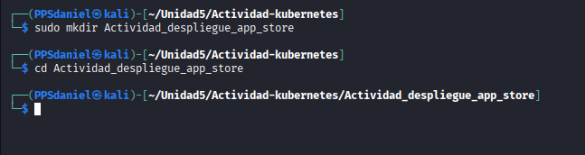

*Descargamos* la app y la *descomprimimos*

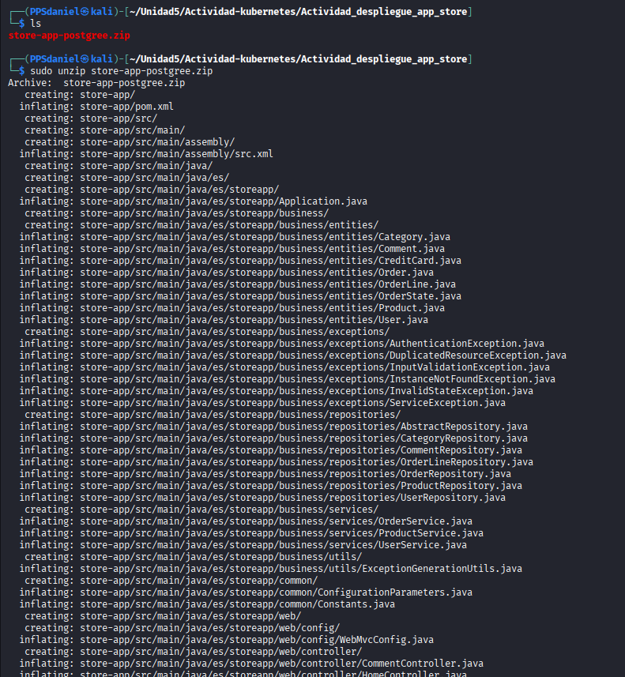

Metemos ***DockerFile*** y el ***Manifest*** dentro de la **aplicacion**

Luego con `minikube start --nodes 3 -p store-app` que lo que hace es crear un clúster local de Kubernetes con 3 nodos y lo guarda con el nombre de perfil *"store-app"*

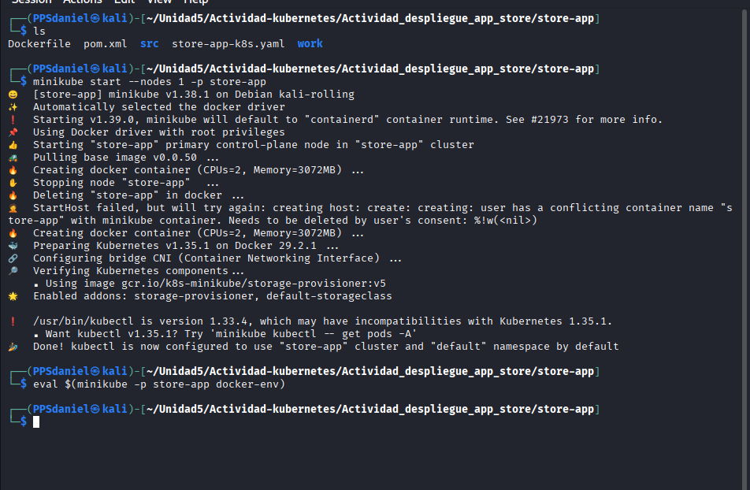

Construye imagen store-app preparado para postgree

> docker build -t store-app:latest .

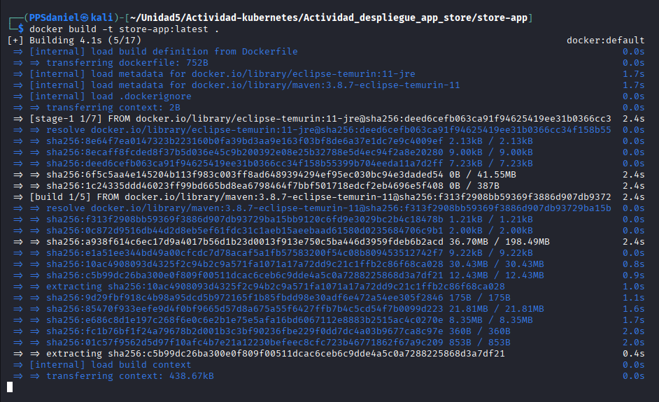

Comprobamos que se ha creado la imagen *store-app* correctamente en docker de *minikube*

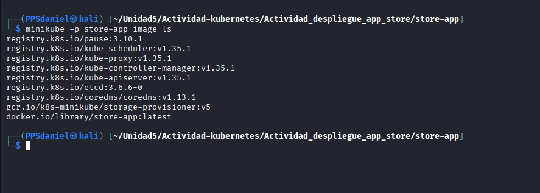

### Despliegue

Hacemos el despliegue en kubernetes:

Con el siguiente comando lo que hacemos es aplicar el **manifiesto kubernetes** de *despliegue* :

> kubectl apply -f store-app-k8s.yaml  

Para comprobarlo ponemos lo siguiente 

> minikube -p store-app service store-app

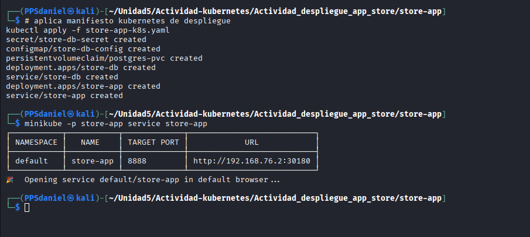

Con este ultimo comando `minikube -p store-app service store-app` se abre una ventana en nuestro navegador con la app en funcionamiento
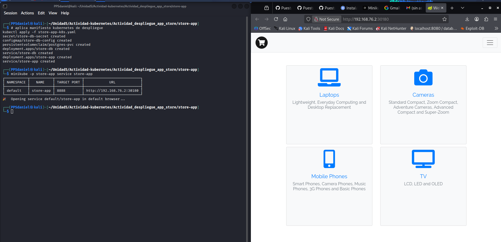

### Verificación

1.  El comando `kubectl get pods` muestra la lista de pods que se están ejecutando en mi *clúster Kubernetes*
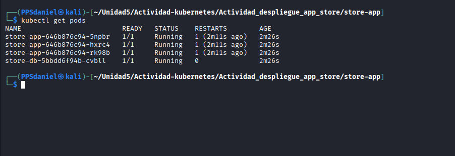

2. El comando `kubectl get svc` muestra la **lista** de servicios que tengo creados en mi *clúster Kubernetes*
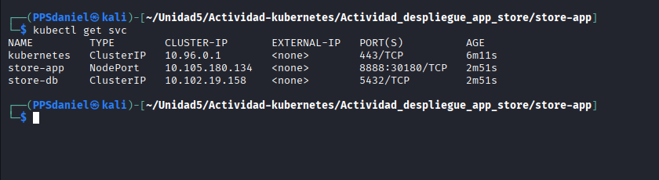
3. El comando `kubectl get configmap` muestra los **ConfigMaps** que tengo creados en mi *clúster Kubernetes*
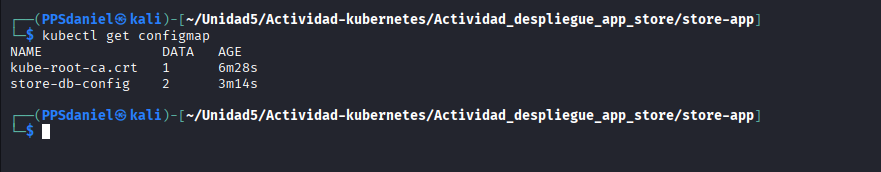
4. El comando `kubectl get secret` muestra los **Secrets** que tengo creados en mi clúster Kubernetes 
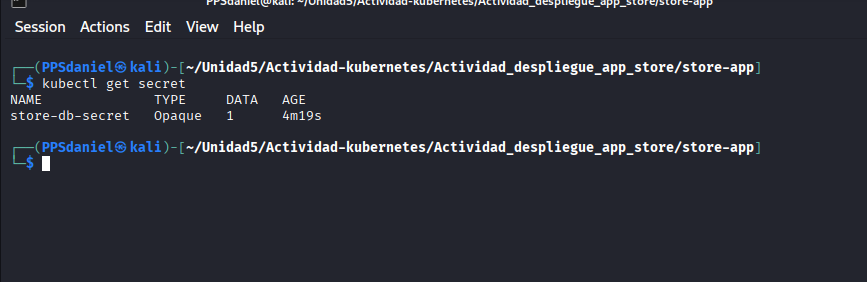
5. El comando `kubectl logs deploy/store-app` muestra los **logs de la aplicación** `store-app` que está desplegada en *Kubernetes*
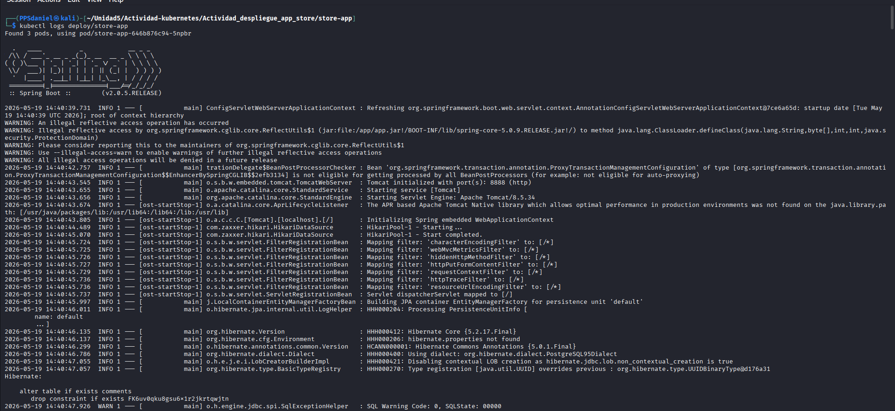
6. El comando `kubectl logs deploy/store-db` muestra los **logs de la base de datos** `store-db` desplegada en Kubernetes
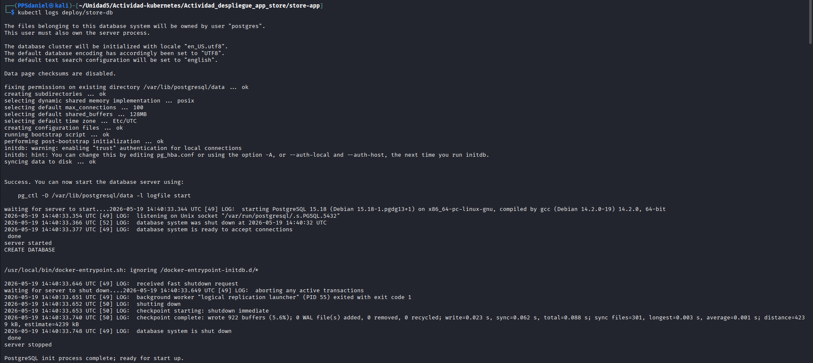
7. El comando `kubectl exec -it deploy/store-db -- psql -U app -d store` **abre una consola interactiva de PostgreSQL** dentro del despliegue `store-db`
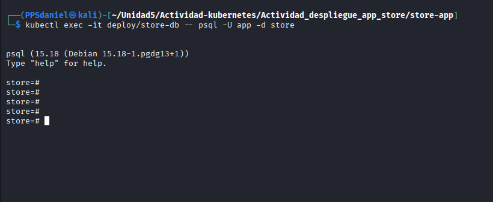
8. El comando `minikube -p store-app service store-app --url` me muestra la **URL externa**para acceder al servicio `store-app` en el perfil de Minikube `store-app`
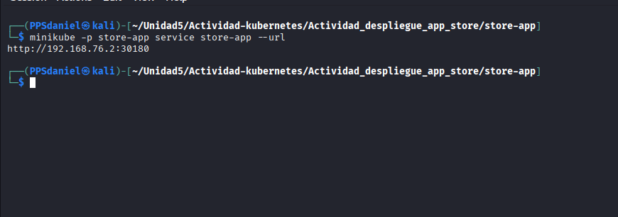
9. El comando `kubectl get all` muestra todos los **recursos principales pods, servicios, deployments y replicasets** que tengo en el clúster Kubernetes
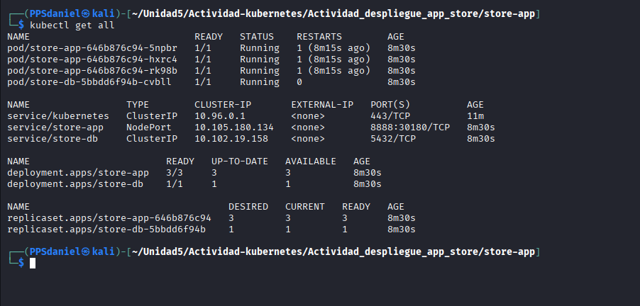
10. El comando `kubectl get endpoints store-app` muestra las **direcciones IP y puertos de los pods** a los que apunta el servicio `store-app`
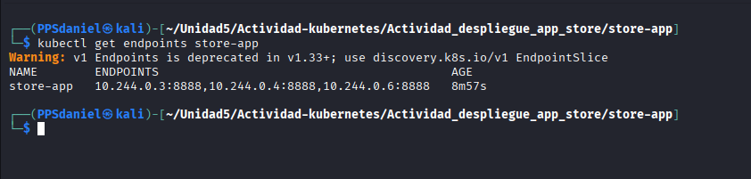

---

#### Responde a las preguntas

- **¿Qué diferencia hay entre ConfigMap y Secret?** 

    Un ConfigMap guarda configuración no sensible en texto plano, mientras que un Secret guarda datos sensibles de forma más protegida

- **¿Por qué PostgreSQL usa ClusterIP y no NodePort?** 

    Porque la base de datos solo necesita ser accesible desde dentro del clúster, no desde fuera, y para eso basta con un servicio interno de tipo ClusterIP

- **¿Para qué sirve el initContainer?**

    Sirve para ejecutar tareas de inicialización, como preparar la base de datos o cargar datos iniciales, antes de que se arranque el contenedor principal

- **¿Qué pasaría si borras el Secret?**

    Los pods que necesiten ese Secret para arrancar o conectarse, como la aplicación que usa credenciales de la base de datos, fallarían o dejarían de funcionar correctamente

- **¿Qué cambiarías para que la base de datos tenga almacenamiento persistente?** 

    Definiría un PersistentVolume y un PersistentVolumeClaim y los montaría en el pod de PostgreSQL para que los datos se guarden en un volumen persistente y no se pierdan al borrar el pod

### Autor

> ***Daniel Trujillo Martin***

